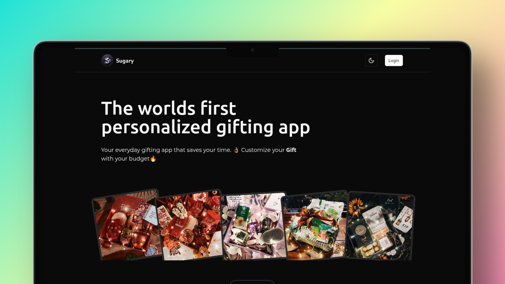

# 🍬 Sugary Recruitment Task — Frontend (Next.js)

This is a frontend recruitment task completed using **Next.js** (React framework), as part of the application process for a frontend developer role at **Sugary**.

Live: [sugary-task.vercel.app](sugary-task.vercel.app)  




---

## 🚀 Tech Stack


---

## ✅ Features

### 🔐 Authentication

- Login page with:
  - Validations
  - API-integrated auth
  - Access + Refresh token handling
- Auto-refresh token logic with Axios interceptors

### 📊 Dashboard

- Protected route (redirects if not logged in)
- Displays:
  - User info
  - Infinite scrolling Material list using lazy loading
  - Material details (title, brand, image, price)

### 🧠 UX/UI

- Fully responsive, mobile-first design
- Clean and intuitive user interface
- Polished transitions and skeleton loading states

---

## 🔧 API Integration

**Base API:** `https://sugarytestapi.azurewebsites.net`  
**Image Base:** `https://d1wh1xji6f82aw.cloudfront.net`

### Endpoints Used

- `POST /AdminAccount/Login` — Login
- `POST /Account/RefreshToken` — Refresh token
- `GET /Materials/GetAll` — Paginated Material list (with base64 filter)

---

## 🛠️ How to Run Locally

```bash
git clone https://github.com/yeasin2002/sugary-react-recruitment.git
cd sugary-react-recruitment
npm install
npm run dev
```
